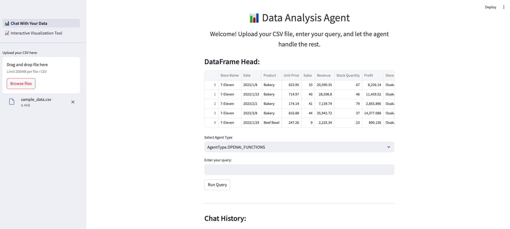

# Hướng Dẫn Xây Dựng Công Cụ Trợ Giúp Phân Tích Dữ Liệu (DAGPT)

## Giới Thiệu

Chào mừng bạn đến với kênh Data Science Lab! Trong video này, mình sẽ cùng với bạn xây dựng một công cụ phân tích dữ liệu hữu ích và tiện lợi là DAGPT (Data Analysis GPT). Công cụ này sử dụng các mô hình ngôn ngữ lớn (LLMs) để hỗ trợ việc thao tác và phân tích dữ liệu thông qua giao diện đàm thoại. Dự án này sử dụng Python, Langchain, Streamlit, PyGWalker, OpenAI API để tạo ra một ứng dụng web tương tác, cho phép người dùng tải lên dữ liệu, đặt câu hỏi, khám phá dữ liệu và nhận được các phân tích chi tiết.

## Application Interface

### Chat With Your Data

Welcome! Upload your CSV file, enter your query, and let the agent handle the rest.

### Interactive Visualization Tool

Welcome! This tool allows you to explore your data interactively using various visualizations. Upload your dataset and start analyzing!

### Demo Video

## Nội dung
### 1. Giới Thiệu về DAGPT

- **Tổng quan:** DAGPT là một công cụ phân tích dữ liệu sử dụng các mô hình ngôn ngữ lớn để hỗ trợ các tác vụ phân tích và thao tác dữ liệu qua giao diện đàm thoại.
- **Tính năng:**
  - **Tải lên tệp CSV:** Dễ dàng tải lên dữ liệu CSV qua thanh bên.
  - **Phân tích dữ liệu:** Nhập các truy vấn về dữ liệu và nhận phản hồi được hỗ trợ bởi LLMs.
  - **Trực quan hóa dữ liệu:** Tạo và hiển thị các biểu đồ dựa trên các truy vấn dữ liệu.
  - **Công cụ trực quan hóa tương tác:** Khám phá dữ liệu một cách tương tác bằng cách sử dụng các biểu đồ tùy chỉnh.

### 2. Công Cụ và Gói Cần Thiết

- **Python 3.9 hoặc cao hơn:** Ngôn ngữ lập trình chính để phát triển ứng dụng.
- **Langchain:** Khung phát triển ứng dụng sử dụng các mô hình ngôn ngữ lớn.
- **Streamlit:** Khung ứng dụng mã nguồn mở cho các dự án Machine Learning và Khoa học dữ liệu.
- **Pygwalker:** Công cụ tạo trực quan hóa tương tác.
- **OpenAI API (tùy chọn):** Sử dụng để truy cập các mô hình ngôn ngữ tiên tiến.

### 3. Hướng Dẫn Chi Tiết

#### Bước 1: Thiết Lập Cơ Bản

- Xây dựng cấu trúc dự án.
- Thiết lập môi trường ảo.
- Cài đặt các gói cần thiết.
- Thiết lập kho lưu trữ Git để lưu trữ mã nguồn dự án.

#### Bước 2: Xây Dựng Công Cụ "Chat Với Dữ Liệu"

- Sử dụng Streamlit để xây dựng giao diện người dùng.
- Sử dụng các bộ công cụ của Langchain để xây dựng công cụ phân tích dữ liệu.
- Sử dụng mô hình GPT của OpenAI.

#### Bước 3: Xây Dựng Công Cụ Trực Quan Hóa Tương Tác

- Nhúng Pygwalker vào giao diện Streamlit để xây dựng công cụ trực quan hóa tương tác.

### 4. Kết Luận

- Với khả năng của LLMs, việc viết một ứng dụng thực hiện các tác vụ phân tích dữ liệu phức tạp hàng ngày trở nên rất dễ dàng.
- Sử dụng Streamlit giúp dễ dàng xây dựng giao diện đàm thoại và các khả năng trực quan hóa mạnh mẽ, làm cho việc phân tích dữ liệu trở nên dễ tiếp cận hơn với mọi người.
- Pygwalker là một công cụ miễn phí và hữu ích thay thế cho Tableau và có thể được nhúng vào ứng dụng của chúng ta.
- Bằng cách làm theo hướng dẫn này, mọi người có thể tự xây dựng công cụ phân tích dữ liệu của riêng mình, tận dụng sức mạnh của LLMs và Streamlit.

## Liên Kết Hữu Ích

- [Streamlit Documentation](https://docs.streamlit.io/)
- [Pandas Documentation](https://pandas.pydata.org/docs/)
- [Langchain Documentation](https://langchain.com/docs/)
- [Pygwalker Documentation](https://pygwalker.github.io/)
- [OpenAI API](https://www.openai.com/)

## Tác Giả

[Data Science Lab](https://www.youtube.com/@datascience-lab) - Người bạn đồng hành cùng mọi người trên con đường chinh phục lĩnh vực Khoa Học Dữ Liệu và AI

---

